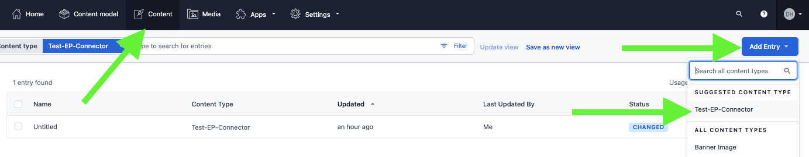

## Elasticpath product connector for contentful

### Setup and Configs

- Step 1: Make sure you have a developer role for your organization
  

- Step 2: Create a custom app with the following and get the `APP_DEF_ID`
  

- Step 3: Install the app to space and save
  
  
  

- Step 4: Complete app configs. Make sure that catalog `tags` and `channel` are exact match of the catalog rules in EP. This will affect the search result, by default it returns the default catalog rules `` (no tags, no channel). (see example below)
  

- Step 5: Create and setup `.env` file (or see `.env.example`)
  ```
  CONTENTFUL_ACCESS_TOKEN=
  CONTENTFUL_ORG_ID=
  CONTENTFUL_APP_DEF_ID=

  REACT_APP_EP_HOST=https://...
  REACT_APP_EP_CLIENT_ID=
  ```


### Use localhost (For dev/testing) or upload the app (For prod/stable version)

**Hosted by localhost**: you can host your app from localhost and sync with contentful using the command `npm start`. Make sure `Frontend` is set to your localhost, see example here:
  

**Hosted by Contentful**: for production or stable version, push your app to contentful
  - Step 1: build the app with `npm build`
  - Step 2: push to contentful `npm upload` or drag the app folder and upload manually
    (make sure Frontend `Hosted by Contentful` is checked)
    
  - Step 3: click `Save` to save the app
    

### Use EP connector (custom app already uploaded)

### JSON Field
When using a JSON field a relationship is 1 entry to many products

  - create a new `content model` for EP connector or add the EP connector as a new `Object` field to another existing content model
    - Step 1: Create `products` field (name/id must be `products`), type is `Object`
    
    
    - Step 2: Select appearance and save
    
    - Step 3: Add content (entry)
    
    - Step 4: Pick products and save
     

### Text Field
When using a JSON field a relationship is 1 entry to 1 product
I.E: We are using Contentful to add extra information to the product page. We need to be able to query a contentful entry based on the product SKU. Using a text field will allow us to do GrapQL queries using SKU
```
query {
  pageProductCollection(where:{skuReference: "1111"}){
    items{
      sys{id}
    }
  }
}
skuReference is the name taken for the custom field
```
1. Create new Field with type `Text`

2. Assign `Appearance` to use the EP App

3. as the example above, add it to the product you will see it show on product page.


Also, you should be able to search the collection by SKU

### Notes: make sure to update the `catalog` list in the app config, this will directly affect the search result.
