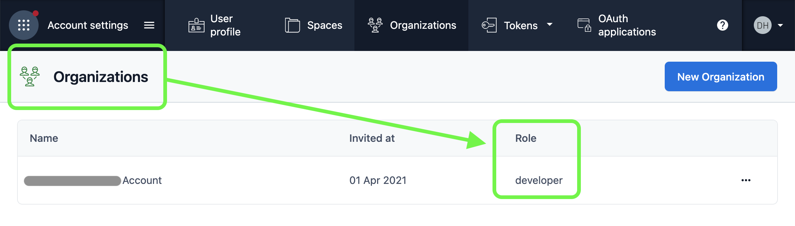

# About the Contentful ElasticPath integration

The Contentful-ElasticPath integration lets you link products by their SKU, or ID, to entries in Contentful. The Products must be `live and published` in ElasticPath. This integration authenticates to ElasticPath using an implicit token using your ElasticPath api Client ID.

Products that are linked from Elastic Path can be easily previewed via the Contentful web app, making it easier for content editors to use the most recently uploaded products across catalogs and sites.

### Features:

- Link one or more ElasticPath products, by Product Id or SKU, inside Contentful content.
- Full-text search for products in ElasticPath when using legacy product api integration
- PCM Catalog integration supports filtering by loading _all_ PCM products and filtering locally in your browser. This may be a performance issue depending on the size of your Catalog. This is a limitation of PCM Catalog api as it does not support filtering. See https://github.com/myplanet/elastic-path-contentful-integration/issues/1
- Preview selected products in Contentful

# Installation Steps

- [About the Contentful ElasticPath integration](#about-the-contentful-elasticpath-integration)
    - [Features:](#features)
- [Installation Steps](#installation-steps)
    - [1. Configure App in Contentful](#1-configure-app-in-contentful)
    - [2. Serve app from localhost or upload to contentful](#2-serve-app-from-localhost-or-upload-to-contentful)
    - [3. Install App to space in Contentful](#3-install-app-to-space-in-contentful)
    - [4. Use EP connector - JSON Field](#4-use-ep-connector---json-field)
    - [5. Use EP connector - Text Field](#5-use-ep-connector---text-field)
    - [Notes: make sure to update the `catalog` list in the app config, this will directly affect the search result.](#notes-make-sure-to-update-the-catalog-list-in-the-app-config-this-will-directly-affect-the-search-result)


### 1. Configure App in Contentful
  - Step 1: You need a developer role for your organization
    

  - Step 2: Create a custom app with the following setup and get the `APP_DEF_ID`
    

### 2. Serve app from localhost or upload to contentful
  - Step 1: Clone this repository to your local environment. Install the dependencies with `npm install`. 
  - Step 2: Create a `.env` file (or see `.env.example`)
    ```
    CONTENTFUL_ACCESS_TOKEN=
    CONTENTFUL_ORG_ID=
    CONTENTFUL_APP_DEF_ID=

    REACT_APP_EP_HOST=https://...
    REACT_APP_EP_CLIENT_ID=
    ```
  - Step 3: Build the artifacts required to install the app to Contentful with `npm run build`. The output will be in `./build`. We'll use these build files in the next step.

  **Hosted by localhost**: host your app from localhost using the command `npm start`. Make sure `Frontend` is set to your localhost, see example here:
    

  **Hosted by Contentful**: push your app to contentful
    - Push to contentful using command `npm run upload` or drag the app folder and upload manually
      (make sure Frontend `Hosted by Contentful` is checked)
      
      

### 3. Install App to space in Contentful
  - Step 1: Click `Save` to save the app
    
  - Step 2: Install the app to space and save
    
    
    (upload or served from localhost)
    
  - Step 3: Complete app configs. Make sure that catalog `tags` and `channel` are exact match of the catalog rules in EP, leave it empty if there is no channel or tags. This will affect the search result, by default it returns the default catalog rules `` (no tags, no channel). (see example below)
    

### 4. Use EP connector - JSON Field
  When using a JSON field a relationship is 1 entry to many products

  - create a new `content model` for EP connector or add the EP connector as a new `Object` field to another existing content model
    - Step 1: Create `products` field (name/id must be `products`), type is `Object`
    
    
    - Step 2: Select appearance and save
    
    - Step 3: Add content (entry)
    
    - Step 4: Pick products and save
     

### 5. Use EP connector - Text Field
  When using a JSON field a relationship is 1 entry to 1 product

  I.E: We are using Contentful to add extra information to the product page. We need to be able to query a contentful entry based on the product SKU. Using a text field will allow us to do GrapQL queries using SKU
  ```
  query {
    pageProductCollection(where:{skuReference: "1111"}){
      items{
        sys{id}
      }
    }
  }
  skuReference is the name taken for the custom field
  ```
  1. Create new Field with type `Text`
  
  1. Assign `Appearance` to use the EP App
  
  1. as the example above, add it to the product you will see it show on product page.
  

  Also, you should be able to search the collection by SKU

### Notes: make sure to update the `catalog` list in the app config, this will directly affect the search result.
